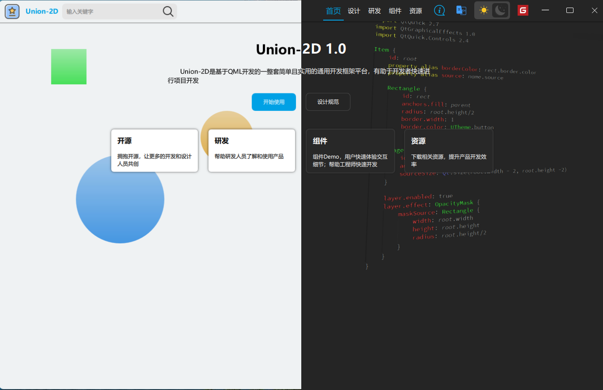
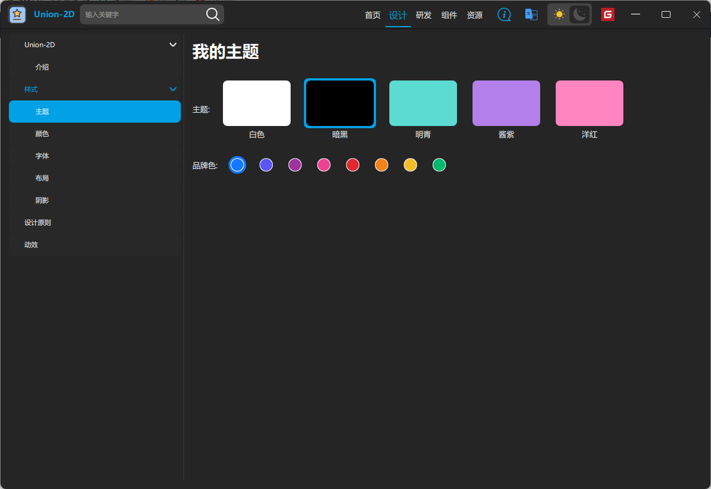
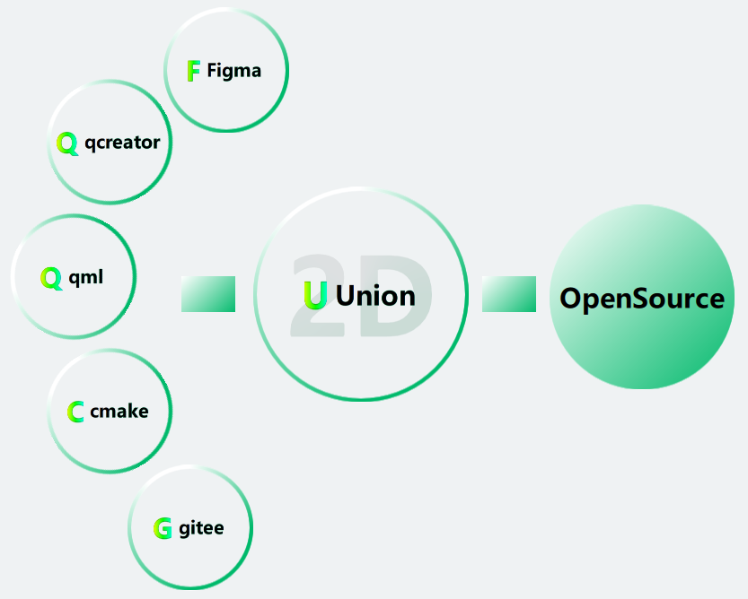

# Union-2D

#### 介绍
Union-2D是基于QML开发的一整套简单且实用的通用开发框架平台，有助于开发者快速进行项目开发，可以进行换肤，各种特效等

#### 软件架构
软件架构说明
cmake 3.10 + Qt 5.15.2

#### 安装教程

1.  xxxx
2.  xxxx
3.  xxxx

#### 使用说明

1. qml/controls目录下包含基础控件，必须以U开头大驼峰命名；
2. 图标规范：深色图标放置目录:icon/dark/；亮色图标放置目录：icon/light/；添加图标文件后，在程序中使用 "qrc:/icon/" + UTheme.themeName + "/xxx.svg" 获取当前主题对应的图标，“xxx” 为图标文件名称；
3. 翻译文件放置在translations目录下且只上传ts文件；
4. 代码中使用颜色首选qml/controls/UTheme.qml文件中的颜色变量，例如：UTheme.text，禁止直接用色值；
5. qml/example目录下包含应用程序的代码；
6. 开发过程中需要图标可以到阿里巴巴矢量图标库下载；

#### 参与贡献

1.  Fork 本仓库
2.  新建 Feat_xxx 分支
3.  提交代码
4.  新建 Pull Request

#### 特技

1.  使用 Readme\_XXX.md 来支持不同的语言，例如 Readme\_en.md, Readme\_zh.md
2.  Gitee 官方博客 [blog.gitee.com](https://blog.gitee.com)
3.  你可以 [https://gitee.com/explore](https://gitee.com/explore) 这个地址来了解 Gitee 上的优秀开源项目
4.  [GVP](https://gitee.com/gvp) 全称是 Gitee 最有价值开源项目，是综合评定出的优秀开源项目
5.  Gitee 官方提供的使用手册 [https://gitee.com/help](https://gitee.com/help)
6.  Gitee 封面人物是一档用来展示 Gitee 会员风采的栏目 [https://gitee.com/gitee-stars/](https://gitee.com/gitee-stars/)
